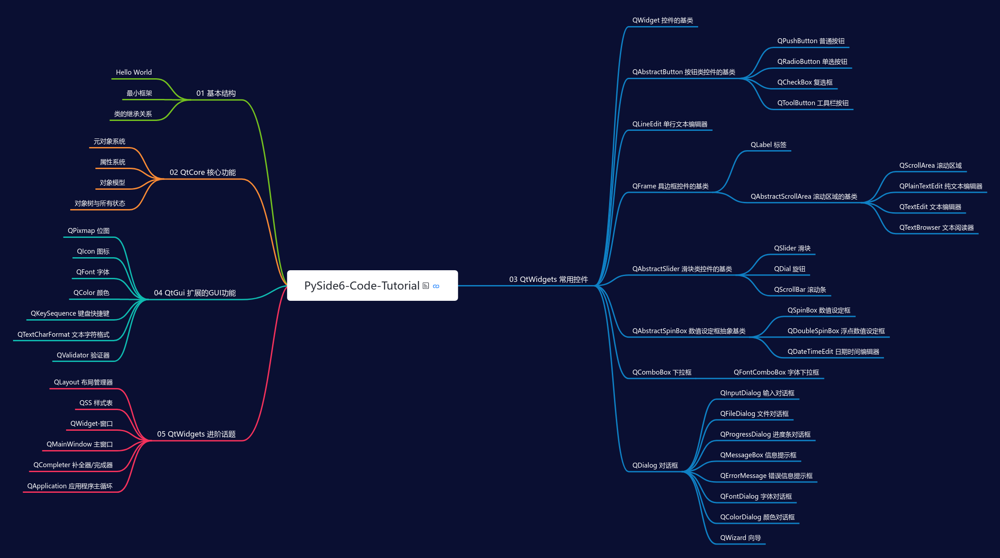

# PySide6 代码式教程

用代码实例讲解 PySide6 ！

## 简介

本教程旨在通过可以直接在本地机器上运行的脚本代码讲解介绍 **PySide6**。

- 代码中以详细的注释作为讲解
- 每个模块（`.py`文件）都可独立运行，演示了各种控件的各种功能、属性、作用
- 在自己的机器上实际运行一下，仔细观察一下每个属性值的改变会怎样影响控件的外观行为，可能比静态的文档教程更有效
- 前身为 GitHub 热度最高的中文 PyQt5 教程 [PyQt-Practice](https://github.com/muziing/PyQt_practice)，目前已有  个 Stars
- 相比 [PyQt-Practice](https://github.com/muziing/PyQt_practice)，改进了项目目录结构，增加了部分内容，更加清晰丰富
- 使用最新的 Python 与 PySide 版本（目前为`3.11`与`6.6`）

希望本项目对你我的 Python-GUI 学习之旅有所帮助。

[访问在线思维导图目录](https://www.processon.com/view/link/63034ce01efad47d1247911e)

## 如何使用

### 一、获取源代码

1. Star 本仓库
2. 通过以下方法之一获取源码
   - 克隆仓库（推荐）：`git clone https://github.com/muziing/PySide6-Code-Tutorial.git`
   - 下载 zip：<https://github.com/muziing/PySide6-Code-Tutorial/archive/refs/heads/main.zip>
   - 查看 [Releases](https://github.com/muziing/PySide6-Code-Tutorial/releases) 界面，下载最新发布版（文件更小）
3. 进入项目目录

### 二、配置虚拟环境与安装依赖

**方式 A** ：[Poetry](https://python-poetry.org/)（推荐）

1. 确保 Python 版本与 [pyproject.toml](./pyproject.toml) 中要求的一致
2. 按[官方文档](https://python-poetry.org/docs/#installation)提示安装 Poetry
3. 创建虚拟环境：`poetry env use /full/path/to/python`（注意替换路径）
4. 安装依赖：`poetry install --no-root --only main`
5. 使用该虚拟环境： `poetry shell`（或在 PyCharm 等 IDE 中配置）

> 更多 Poetry 使用方法信息，请参阅其[官方文档](https://python-poetry.org/docs/)。

**方式 B** ：[venv](https://docs.python.org/zh-cn/3/library/venv.html)（简单易用）

1. 确保 Python 版本与 [pyproject.toml](./pyproject.toml) 中要求的一致
2. 创建虚拟环境
   - Windows: `python -m venv --upgrade-deps venv`
   - Linux/macOS: `python3 -m venv --upgrade-deps venv`
3. 激活虚拟环境
   - Windows: `venv\Scripts\activate`
   - Linux/macOS: `. venv/bin/activate`
4. 安装依赖：`pip install -r requirements.txt`

**方式 C** ：其他包管理工具

1. 使用你喜欢的其他工具创建虚拟环境，如 [Pipenv](https://pipenv.pypa.io/)、[Conda](https://www.anaconda.com/) 等
2. 安装 [requirements.txt](./requirements.txt) 中描述的依赖项

### 三、运行与学习

1. 打开感兴趣的 `.py` 模块
2. 阅读文档部分
3. 运行，观察该界面/控件效果
4. 阅读代码中的注释，可根据提示对特定行进行「注释/取消注释」
5. 再次运行该模块，观察变化

## 项目结构

### 主要

| 目录/文件                                                           | 描述                                  |
|-----------------------------------------------------------------|-------------------------------------|
| [00. PySide Learning - 各种学习资源](./00-PySideLearning-文章教程Demo等资源) | 文章、教程、Demo等资源                       |
| [01. HelloWorld - PySide 基本结构](./01-HelloWorld-基本结构)            | 新手上路，PySide6 程序的基本结构                |
| [02. QtCore - 非GUI的核心功能](./02-QtCore-非GUI的核心功能)                 | 元对象系统、「信号与槽」通信机制等                   |
| [03. QtWidgets - 常用控件](./03-QtWidgets-常用控件)                     | 按钮、输入框、文本编辑器、下拉菜单、滚动条等等常用控件的功能、用法   |
| [04. QtGui - 使用GUI功能扩展QtCore](./04-QtGui-使用GUI功能扩展QtCore)       | 位图、字体、颜色、键盘快捷键等、事件                  |
| [05. QtWidgets - 进阶话题](./05-QtWidgets-进阶话题)                     | 布局管理器、QSS样式、主窗口控件等                  |
| [06. Model/View - 模型与视图、数据库](./06-ModelView-模型与视图、数据库)          | 模型与视图、与数据库交互                        |
| [07. Packaging - 静态资源编译、打包](./07-Packaging-资源管理与打包)             | 将应用程序打包为 `exe`、将静态资源编译至二进制 `qrc` 文件 |
| ……                                                              | ……                                  |

### 其他

| 目录/文件                                          | 描述                |
|------------------------------------------------|-------------------|
| [requirements.txt](./requirements.txt)         | 依赖项，运行本项目必备       |
| [pyproject.toml](./pyproject.toml)             | 项目配置文件            |
| [poetry.lock](./poetry.lock)                   | Poetry 依赖项版本约束文件  |
| [.gitignore](./.gitignore)                     | git 忽略提交规则        |
| [LICENSE](./LICENSE)                           | 代码开源许可证           |
| [LICENSE-Article](./LICENSE-Article)           | 文章许可协议            |
| [CONTRIBUTING.md](.github/CONTRIBUTING.md)     | 贡献指南              |
| [Resources](./Resources)                       | 图片等静态资源           |

## 贡献

PySide6 Code Tutorial 是一个开源项目，非常期待以及感谢你的参与贡献。共同完善这个项目，让它帮助到更多人。

贡献的方式有很多种，并不一定都需要高超的编程能力：

- 指出错别字、错误拼写等
- 提议加入新功能、新模块等
- 参与某个 QWidget 控件相关代码编写
- 投稿优质 PySide6 相关博文、QSS 样式等
- ……

关于为本项目提交贡献的详细信息，请查阅[贡献指南](.github/CONTRIBUTING.md)。

## 开源许可与分享约定

### 代码

本仓库中的代码使用 [GPL-3.0](https://www.gnu.org/licenses/gpl-3.0.en.html) 许可开源。对本项目的复制、分发和修改，请严格遵守该协议。

为便于使用者在自己的项目或博客文章中使用本仓库的代码片段，作以下分享约定：

| 类型           | 代码行数   | 来自模块           | 使用要求                                                                      |
|--------------|--------|----------------|---------------------------------------------------------------------------|
| 少量代码         | < 100  | 单个 `.py` 模块    | 直接复制使用即可，无需声明                                                             |
| 短片段          | < 500  | 6 个以内 `.py` 模块 | 在代码首行添加 `# 来自 github.com/muziing/PySide6-Code-Tutorial` 注释；如对代码有修改则必须明确声明 |
| 基于本项目修改衍生的项目 | \> 500 | 多个 `.py` 模块    | 严格遵守 GPLv3 相关要求                                                           |

### 文章

本仓库中的文章，凡未注明作者的，均为 [muzing](https://github.com/muziing) 所著，使用 [CC-BY 4.0](https://creativecommons.org/licenses/by/4.0/) 协议发布。

## 打赏

本项目的[主要作者/维护者](https://muzing.top/about/)是一名还没有收入的在校学生，如果本项目对你有帮助，希望可以请他喝一杯冰可乐 :beer:。

